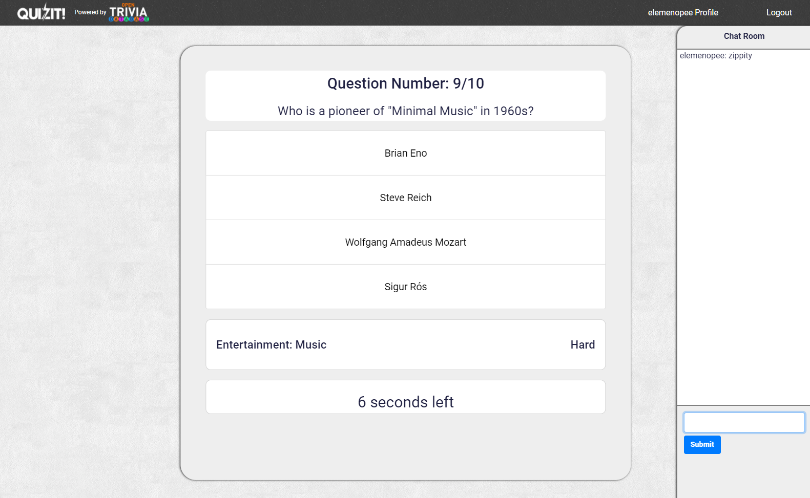
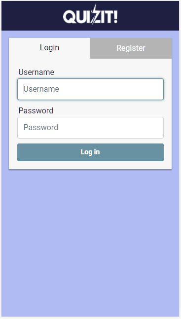
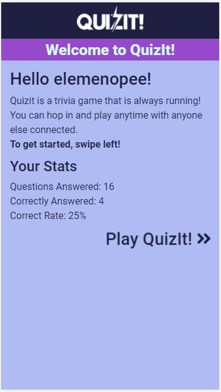
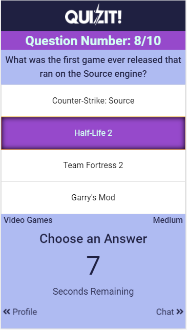
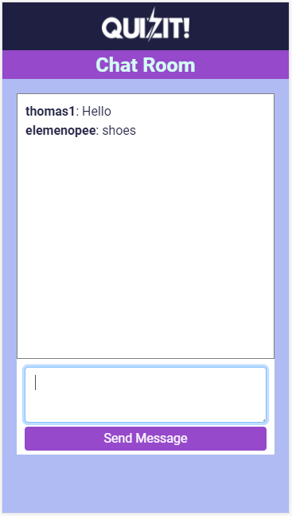

# Quizit First Deployment Phase

QuizIt is a trivia game that is always running! You can hop in and play anytime with anyone else currently connected. The game utilizes socket.io to communicate between the server and the client. It is built with a full MERN stack, Mongo, Express, React, and Node.

# Preview of desktop site:

# Preview of mobile site:

# How to use the site.

1. First register or login.
2. Select an answer.
3. See if you got it right or wrong.
4. Argue with people in chat.
5. Win???

# To-do-list

* Profile management (avatar, stat reset, etc)
    * More game statistics
    * How many connected users
    * How many voted for what
* Authentication system
    * Password Reset
    * Email confirmation
    * Other login options (facebook, google, etc)
* Chatroom
    * Profanity filter
    * Limited chat history
    * Scroll to bottom button after scrolling up
    * Time stamps
* Mobile
    * Speech bubble showing most recent chat
    * Horizontal display compatibility
    * Scrolling chat
    * Media queries, media queries, media queries
    * Leaderboard formatting
    * Landscape detector
* Question game phase
    * Show how many people chose an answer
    * Clearer indicators of right or wrong or unanswered (icons / animations)
* Server
    * Removing nested for loops
    * Optimize game loop
    * Better ways to handle disconnects / desyncing
    * Remove idle/disconnected users from session
* React
    * Adding ads during pregame/loading phases
    * More styling
    * Splash/Home page for mobile explaining/previewing what the game is
    * Move logout page to home.js
* User submitted questions
* Custom private/public game rooms